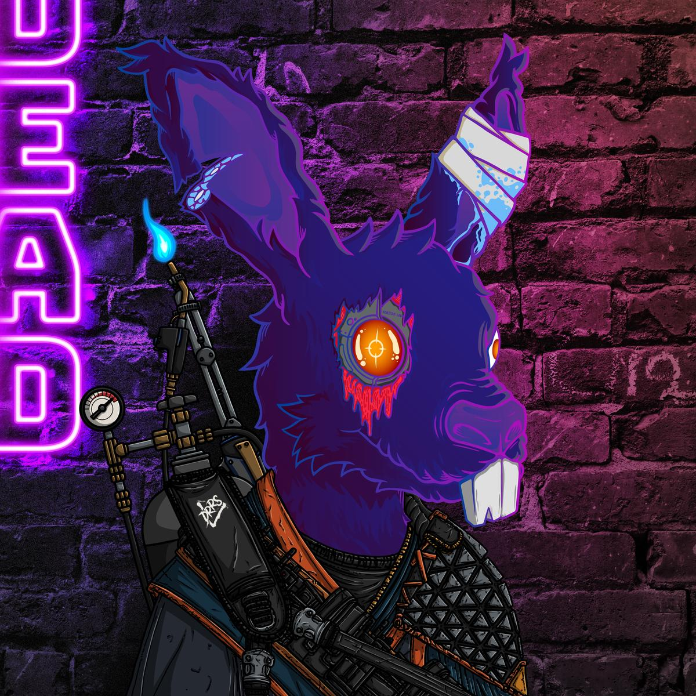
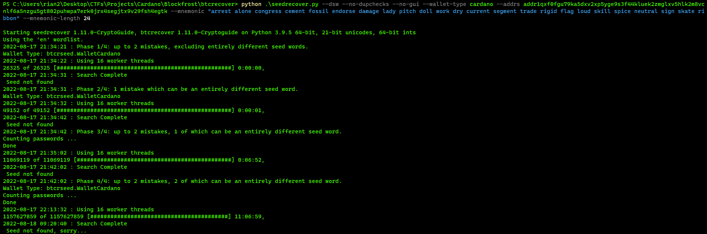

# The Search for 237

THE SEARCH FOR SUPREME 237 GOES LIVE THE INSTANT SUPREMES MINT

 This hunt is for the entire CNFT community, you do not need to be CLAN to participate.

 Once the Supremes mint, the clues are out there.

 Once you solve them, you can claim ultra-rare Supreme 237 as your reward.

 You will not need to check in, or verify anything about your solve.  Once you have solved the Search for Supreme 237, you will know what to do.

 No hints will be given.

Happy hunting!!   

 


### Cerkoryn
#### Finding and decoding the clues
The clues were found in the description part of the Supremes when they were minted.  Starting from Supreme 001-015, there was a single 6-7 character string that looked like garbage, but decoded to legible text using ROT-13.  From Supreme 015-175, the ROT-13 cipher only worked on odd numbers, and then from 176 to 228 all numbers were used again.

From Supreme 16-52 on ONLY EVEN NUMBERS there were 4-letter words that appeared to be jibberish.    
From even numbers on Supremes 54-128 there were pairs of two digits.    
From even numbers 130-173 there were six-digit numbers.    
And Supreme 174 simply had the number '15'.    
Supremes 229-333 did not have any hints on them.

Additionally, questions 16 and 23 had additional info to be used with these numbers after they were decoded from ROT-13:    
> Sixteenth is not here keyword is theta.        
> Twentythird is found elsewhere the keyword is fiddle.    

Using Vignere and Polybius ciphers when combined with the keywords for 16 and 23, we were able to decode two additional questions and one additional (partly bogus) hint:
> Sixteenth is yours your quest is close to ending This ones a word that means stiff or unbending.    
> You've found twenty three lets hope you're not late.  This one is performed at a park, rink, or lake.    
> Now if three of your answers end in 'ment', choose one, subtract, and then add back the 'e'.    

\* I say partly bogus because it turns out that the actual answer for the `ment` hint didn't require adding back an `e` as stated by the question.  This was an honest mistake, but it really added to the fun by throwing us for a loop.  This hint could have been referring to `endorsement` -> `endorse` from question 6 or `arrangement` -> `arrange` from question 24.
    
        
#### Solving the riddles
`1. The start means to stop the first step toward the clink.` **ARREST**    
The hardest part about this question was determining whether it was two clauses or just one.  I.e.,    
> "The start means to stop.  The first step toward the clink" 
   
Or    
> "The start means to stop the first step...."    

We collectively agreed that the dual-meaning for the word arrest (to stop as in heart arrest) vs going to the clink (jail) made **arrest** the ideal answer
    
     
`2. When second you likely have more time to think.` **ALONE**    
This was one of the hardest ones because we had a laundry list of viable answers.  What made it worse was that a critical piece of information was missing from one Supreme that wasn't minted yet.  So the question could have been...    
> "When second you like to take more time to think."    
> "When second you like to have more time to think."    
> "When second you likely have  more time to think."    

Even once we found out the missing piece, we still had a large list of answers we had to try.      
> Patient, apart, alone, old, young, idle, notable, etc.    

Fortunately, **alone** was one of our favorite answers we liked to test with, and it turned out to be the correct one.
    
    
`3. Third is a meeting of those voters sent.` **CONGRESS**    
For this question we had a few answers, but **Congress** easily stood out as the best from early on.
    
    
`4. The mob puts your feet in the fourth if no rent.` **CEMENT**    
For this question we had `fire` and `water` come to mind as well, but the mob reference was referring to the legend about the mob encasing the feet of people they didn't like in **cement** and dropping them in the water.  Also, the rhyme fit with `sent` and `rent`.
    
    
`5. Fifth from dinosaurs trapped in soils beneath.` **OIL**    
This is ultimately what kept us from finding the solution for about a full week.  We were so sure of the answer `fossil` to this question because it fit so well.  Also, `bone` was a close second.  It wasn't until alex.ada suggested oil as an alternative answer to this question and soggy waffles included it in his tests that were were able to find the final solution.  I personally wrote off **oil** as a sub-optimal answer so I excluded it from my own tests, but it turned out to be the correct answer 😑
    
    
`6. Sixth upon candidates unions bequeath.` **ENDORSE**    
Another semi-tough one.  We had a handful of other answers we tested against this question:
> endorse, donate, pledge, vote, credit, come, judge    

`judge` and `come` seem to not fit very well, but because of the additional clue about removing `ment` and adding back an `e` we were determined to make `comment` or `judgment` work as an answer somewhere, and this was one of the few that might have fit.  Turns out we were JEBaited by that "hint" and `endorse` was right all along.
    
    
`7. Seventh you take when you suffer a hit.` **DAMAGE**    
We actually thought this was `abuse` initially and left that as our answer for a while.  But then gary suggested **damage** and we knew it had to be that because of Jeb's love of D&D.
    
    
`8. Eighth you stand up for when she wants to sit.` **LADY**    
This one we though of **lady** fairly early and then never came up with anything better.  Relatively easy.
    
    
`9. Ninth is how horseshoes come to land 'round the post.` **TOSS**    
For this, we were sure the answer would be either `pitch` or **toss**.  We also had `ring` as a third option, but it had to be one of those so we tested with all of them.
    
    
`10. Tenth and a pink dress what young girls want most.` PONY    
We had a handful of answers for this at first too:    
> Romance, pet, doll, pony, candy, puppy, kitten    

But we narrowed it down to mostly `doll` and **pony**.  The latter ended up being correct.
    
    
`11. Eleventh you do so your paper stack grows.`  **INVEST**    
Another very hard one.  Eligible answers:    
> invest, print, copy, work, earn, document    

We didn't feel particularly great about any of them, but **Invest** was still near the top of our list and ended up being the answer.
    
    
`12. Twelfth describes deserts but not freshly washed clothes.` **DRY**    
One of the easier ones.  We got **dry** pretty early and never looked back.
    
    
`13. Thirteenth the movement in rivers defines.` **CURRENT**    
Another relatively easy one.  For a little bit we entertained answers such as `valley`, `canyon`, etc., but the question says movement *IN* rivers not *OF* rivers.  **Current** is the correct choice.
    
    
`14. Fourteenth a part of especially for lines.` **SEGMENT**    
Perhaps the easiest one.  We had almost no discussion on this after we landed on **segment** since that is what you call a part of a line.
    
    
`15. Fifteenth you do to acquire without ADA.` **TRADE**    
This one was difficult.  **Trade** and `exchange` were our top answers, but we weren't particularly confident on them.  We came up with a lot of alternative answers, but none quite as good as those two.
    
    
`16. Sixteenth is yours your quest is close to ending This ones a word that means stiff or unbending.` **RIGID**    
This question came as a result of a vignere cipher.  Fortunately, the question itself wasn't too difficult.  **Rigid** came to mind pretty quick and using a thesaurus we weren't able to find anything that would've fit better.
    
    
`17. Seventeenth is hoisted up pole mast or post.` **FLAG**    
Really straightforward.  Just **flag**.
    
    
`18. Extremely eighteenth and incredibly close.` **LOUD**    
For the first day we were a little stumped on this.  But then we tried too Google it and got lucky to see a film/novel by the title "Extremely Loud & Incredibly Close".  We knew that **loud** had to be the answer after that.
    
    
`19. Nineteenth the attribute needed by experts.` **SKILL**        
IMHO this was definitely the hardest question.  There are TONS of answers that could fit this question...    
> judge, practice, wisdom, skill, talent, genius, opinion, etc.    

This was further complicated by the fact that we needed a question to take away `ment` and add back an `e`.  There were only a few words in the English language that also became BIP-39 words that would have fit.  Those were...    
> argument -> argue    
> judgment -> judge    
> comment -> come    

...and a few other obscure words that didn't really fit anything.  And of those, `judgment` seemed to fit best and in this particular question.  Personally I was dead sold on `judge` here for that reason so I didn't often test with other words.  Ultimately though, that clue ended up being JEBait 😵 and **skill** was the correct answer.
    
    
`20. Twentieth the asset Arrakis exports.` **SPICE**    
If you've watched or read Dune then it was a dead giveaway.  Otherwise, it only took a simple Google search to figure out what "Arrakis" is.  They export **spice**.
    
    
`21. Twentyfirst is a character right in the middle.` **NEUTRAL**    
This one was difficult as well and we tried a lot of things using "character" to refer to alphabetic characters and characters from popular movies and stories.  We ended up agreeing that **neutral** in regards to a center-aligned character in D&D (i.e., True Neutral) fit Jeb's personality the most.
    
    
`22. Twentysecond for when you buy after you pay.` **OPTION**    
Another very difficult one.  We had **option** and `call` at the top of our giant list of potential answers, but we didn't feel particularly great about it.  Fortunately, the former turned out to be correct.
    
    
`23. You've found twenty three lets hope you're not late.  This one is performed at a park, rink, or lake.` **SKATE**    
This one decoded from a Nihilist cipher using the keyword `fiddle`.  Once we had the whole thing decoded, we were sold on either **skate** or `hockey` as the answer.  But due to the rhyme, **skate** fit much better.
    
    
`24. The last is for flowers to make a bouquet.` **ARRANGE**    
We had **arrange** early on, but began to doubt that as the answer in favor of a couple other answers like `bundle` or `ribbon`.  Good thing we kept **arrange** high on the list though because it ended up being correct.
    
        
So how we going about testing these answers?  We actually all had different methods, which gave us a very good variety of things to try.  Alex used his RPA bot, gary and soggy waffles had Javascript and Python scripts to check for valid wallets and then subsequently check if they were empty or not.  Jane and Benjamin did things the old-fashioned way, which was valuable to make sure we weren't overthinking it.  What I did was use an open source tool called `btcrecover` that works with Cardano Shelley wallets/addresses.  Basically, all I needed to do was input that address that Bernal was sitting at and my "best guess" for what the whole seed phrase would be, and then a few less-relevant CLI options to get it running in the right mode.  The tool was able to find the answer as long as I had AT MOST two words incorrect.  With three or more incorrect it wouldn't find the answer.  It took 11-12 hours to run each time and it turns out I just got really unlucky with my guesses, as I had 3-4 incorrect each attempt.  But it WAS an increibly fast method of checking answers, with over a _billion_ seed phrases checked each run through.  I highly recommend this tool for others trying to attempt seed phrase cracking challenges.    

https://github.com/3rdIteration/btcrecover    
    


### J4vaJ4ne
This hunt was definitely a different style than the hunt for ronin for me. Less rabbit holes for sure, more process of elimination style. My brain thinks a little differently than the more tech oriented team Mates. I concentrated on digesting each question to think of all possible answers and reading every word on BIP to come up with new possible words. I'd say overall we had most of the right answers in the beginning but when it wasn't working we started to overthink and thus came up with too many possible words further complicating things. Every few days we'd go back through all the questions and answers attempting to narrow the words down. I also like color coding answers to get a visual of which ones we were solid on and which ones less solid. One answer everyone thought was solid from the beginning was fossil. That is what caused the hunt to drag on for us thinking it was one of our 100% answers. Then the riddle about remove "ment" add back the e really threw us off as we kept changing solid answers to attempt to put in judge to fit the riddle. Our team worked even smoother than last hunt as we had the experience down and we started from the get go as a team. Last hunt everyone attempting to start out solo or in twos made things take longer and building trust with a team. We had the trust, friendships, and experience to get the mission done again. And let's not forget commitment! Not many understand the sacrifice and the time and devotion it takes to win one of these hunts. We had the commitment and put in the time and effort as a team to win. Thank you Jeb for yet again another brilliant hunt, thankful for all you do for the Dead Rabbit Ressurection Society!


### gary
The mint began and we were eager to get started. I knew we had an advantage as developers familiar with the CNFT space. I usually watch the chain when a mint I'm interested in is happening. As the Supreme mint was happening, I grabbed all the metadata as the mint progressed. I already had this code, and just needed to modify it a little bit to give us additional insight into the challenge. I saw the additional data on the last line of the description. Once the pattern was identified, I updated the code to automatically decipher the ROT-13 lines, and from there we worked toward the other puzzles in the metadata. As new Supremes were minted, we would keep getting updated intel.


### BenjaminTheRelentless
From my perspective it started with the strings of characters in the Metadata.  I noticed that a bunch of supremes had the strings of characters and I posted it here, about 5 minutes later, Bre started posting what he had found from the first 100 supremes and we started working  off of that.  The team started decoding that into the riddles.  We began posting our best answers to the riddles.  We got to the point where we felt we had the correct answers. Some riddles we had more than one possible, so we tried to use reason and logic to narrow it down.  When we felt we were close enough to start attempts at recovering the wallet, we employed some automation to help out (cause why work harder when you can work smarter).  Then, much like last time, we reinserted a discarded potential answer into the seeds being tested, 'oil' , and we solved the puzzle.  I wish I had pushed harder for 'oil' when I first suggested it on the 11th but 'charm' still haunts me and I didn't want to be the one steering the group in the wrong direction.


### soggy waffles
Reading the bip list quickly became a daily activity. Which very quickly lead to more and more potential answers stacking upon an already inconceivably long list of potential answers.

So, after days upon days of brainstorming and pouring through the bip list, it became apparent that manually inputting what amounted to far more than 100 million potential seed phrases wasn’t going to be doable.

The next step obviously required an automated solution. We tossed together a python script that utilized cardano CLIs, python libraries, and tangocrypto. Basically the script that ultimately found Bernal did the following:

1. Checked if the menomic’s checksum was valid
2. Checked against our local “database” whether or not the mnemonic was one we’d already seen
3. Derived a wallet id from the mnemonic
4. Derived a wallet address from the wallet id
5. Derived a stake adress from the wallet addr
6. And then checked the balance of that address for anything none zero

    Instead of checking the wallet balance, we could have simply compared our stake addresses with Bernal’s publicly available stake address, but we weren’t sure how tricky Jeb and team were being. It was possible that Bernal was not in the wallet we were trying to “crack”.

The first night the script was fired up:

```
NUMBER OF PERMUTATIONS 107,495,424

RESULTS:
(TANGO CRAPPED OUT)

Duplicates ::  651
Total checked ::  1526067
Total balances checked ::  5445
Total valid stake addr ::  0
VALID WALLETS WITH A BALANCE::
 []
```
 
Unfortunately it crapped out after checkng 1,526,067 wallets. The culprit was either Tango refusing our connection(rate-limiting) or a power outage during some wicked thunderstorms. Either way, the next morning, the word list was pruned down a bit. Resulting in only ~53 million possible mnemonics. 

And then, an hour or so later… HUZZAH!!!

Somewhere around the 2.4 millionth query Bernal was found!!!!

```
NUMBER OF PERMUTATIONS 53,747,712

Duplicates ::  6097
Total checked ::  2431381
Total balances checked ::  3510
VALID WALLETS WITH A BALANCE ::
 [(('arrest', 'alone', 'congress', 'cement', 'oil', 'endorse', 'damage', 'lady', 'toss', 'pony', 'invest', 'dry', 'current', 'segment', 'trade', 'rigid', 'flag', 'loud', 'skill', 'spice', 'neutral', 'option', 'skate', 'arrange'), '24d2ada18c9951030ae9837dfdc1bc76478e9a5b', 'addr1qxf0fgu79ka5dxv2xp5yge9s3f44kluek2zmglxv5hlk2m8vcnlf6a5nzgu5gt802puhwpa7erk0jrx4segjtx9v29fsh4egtk', stake1u8kvfl5aw6f3yw2y9nh4q7thq7lv3m8epn2cv5f9nzk9z5cmrap3g, 1580280)]
TANGO FAILS :: []
```
